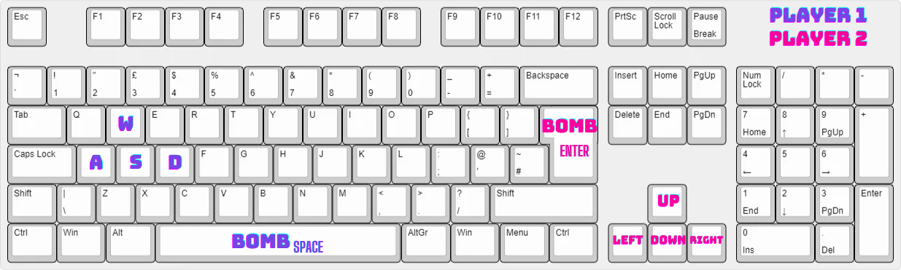

# Kaboom Combat
"Kaboom Combat" is an action game inspired by the popular game Bomb It. The game aims to provide users with an exciting experience, in which players will be tasked with eliminating their opponents using bombs and various power-ups. The game is written in Python.

## Concept graphic

## Power-up
In "Kaboom Combat," players have the opportunity to enhance their gameplay experience by collecting  power-ups. These power-ups provide temporary boosts and advantages to the players, allowing them to gain an edge over their opponents. Players can collect these power-ups by moving their character over them. 
###  Shield
When collected, a shield power-up creates a protective barrier around the player's character, effectively shielding them from the explosions caused by bombs. This shield remains active until the player is hit by a bomb explosion. Upon being hit, the shield absorbs the impact and prevents the player from being eliminated. However, the shield is consumed and disappears after a single use, and players must collect additional shield power-ups to regain its protective benefits.
###  Extra Live
 As the name suggests, this power-up grants players an additional life, giving them an opportunity to continue playing even after being eliminated by an opponent's bomb. When a player collects an Extra Life power-up, it adds an extra life to their overall pool of lives. If the player is hit by a bomb explosion, they lose a life but can continue playing with the remaining lives. Players must collect more Extra Life power-ups to replenish their stock of lives and ensure they have multiple chances to stay in the game.

## Threads
### timer.count_down
This thread is responsible for managing the game timer and counting down the remaining time for each round. It ensures that the game progresses within the given time limit.
### spawn_items
The second thread handles the spawning of power-up items throughout the game. It periodically generates and places shield and extra life power-ups at strategic locations within the game environment.
### spawn_cubes
The third thread is responsible for spawning cubes within the game world. These cubes serve as obstacles or destructible elements, adding an extra layer of complexity and interaction. The thread generates and positions cubes dynamically, creating a dynamic and ever-changing game environment.

## Critical Section
### Lock
Lock mechanism is used to control access to the global cord_list, which stores information about the positions of objects. By applying the lock, the game ensures that only one thread can access and modify the cord_list at a time, preventing multiple elements from being written to the same location simultaneously.
### Semaphore
Semaphore is utilized to generate a predetermined number of cubes at the start of the game. The semaphore acts as a synchronization primitive, allowing a limited number of cubes to be spawned initially. This mechanism ensures that the game begins with a balanced and controlled number of cubes, providing a suitable challenge for the players.

## Control
Controls in the game are simple. Player 1 moves the character using the A, W, S, D keys and places the bomb by pressing the Space bar. Player 2 moves the character using the arrow keys and lays the bomb by pressing Enter (also Return on the numeric keypad).
<<<<<<< HEAD
### 
=======

>>>>>>> test
